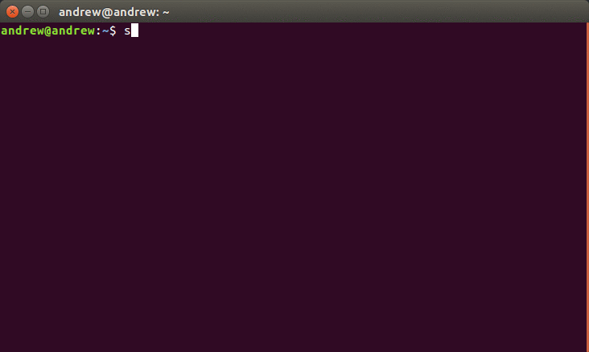

# stocki

`stocki` is a CLI interface for fetching stock market data. Data provided for free by
[IEX](https://iextrading.com/developer/). View [IEX’s Terms of Use](https://iextrading.com/api-exhibit-a/).

## Installation

`$ pip install stocki`

## Contributing

If you've discovered a bug or have a feature request, create an [issue](https://github.com/andrewrporter/stocki/issues/new) and I'll take care of it!
